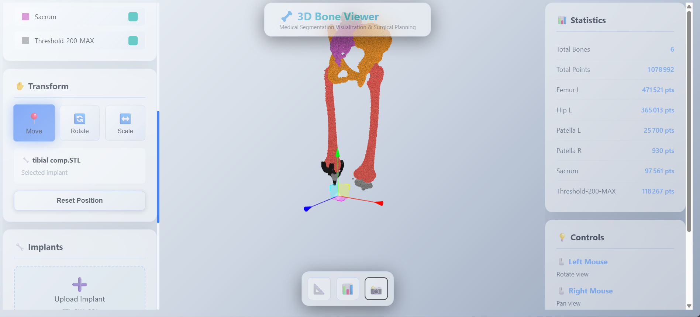

<div align="center">

# 🦴 3D Segmentation and Modeling of Lower Limb Bones

[](https://python.org)
[](https://pytorch.org)
[](https://github.com/MIC-DKFZ/nnUNet)
[](https://developer.nvidia.com/cuda-toolkit)
[](https://fastapi.tiangolo.com)
[](LICENSE)

**An end-to-end medical imaging solution for automatic bone segmentation & interactive 3D visualization**

[🚀 Quick Start](#-quick-start-guide) • [📖 Documentation](#-project-overview) • [🖥️ Bone Viewer App](#-3d-bone-viewer-application) • [📊 Results](#-expected-performance)

</div>

---

## 📋 Project Overview

A comprehensive medical image analysis platform combining **state-of-the-art deep learning segmentation** with an **interactive 3D visualization application**. This project delivers a complete clinical workflow from raw CT scan preprocessing to surgical planning visualization.

<div align="center">

| 🧠 **AI Segmentation** | 🎨 **3D Visualization** | ⚡ **Production Ready** |
|:---:|:---:|:---:|
| nnU-Net v2 powered | Three.js rendering | PWA + Clean Architecture |
| 8 anatomical classes | Real-time interaction | Offline-capable |
| 5-fold validation | Medical color schemes | RESTful API |

</div>

### ✨ Key Features

- 🔬 **Automated Bone Segmentation** — Segment 8 anatomical structures (Femur, Hip, Patella, Sacrum) bilaterally with clinical-grade accuracy
- 📊 **3D Volumetric Analysis** — Process full 3D CT volumes for comprehensive spatial analysis
- 🖥️ **Interactive Visualization** — Web-based 3D bone viewer with implant planning capabilities
- 🏗️ **Clean Architecture** — Production-ready backend with scalable domain-centric design
- 📱 **Progressive Web App** — Installable, offline-capable frontend
- 🔁 **Reproducible Pipeline** — Complete workflow for data preparation, training, and inference

---

## 🎯 Project Scope

### Anatomical Targets (8 Classes)
The pipeline segments the following structures from lower limb CT scans:

<div align="center">

| Structure | Count | Side | Clinical Relevance |
|:----------|:-----:|:----:|:-------------------|
| 🦴 Femur (Thighbone) | 2 | Left & Right | Hip/Knee replacement |
| 🦴 Hip (Pelvis/Acetabulum) | 2 | Left & Right | Hip arthroplasty |
| 🦴 Patella (Kneecap) | 2 | Left & Right | Knee surgery |
| 🦴 Sacrum (Base of Spine) | 1 | Single | Spinal procedures |
| 🦴 Bone Threshold Region | 1 | Single | General analysis |
| **Total Classes** | **8** | — | — |

</div>

### Data Characteristics
- **Dataset Size**: 23+ manually segmented CT cases
- **Image Modality**: Computed Tomography (CT)
- **Image Format**: Medical imaging standards (NRRD → NIfTI)
- **Spatial Resolution**: Variable, with median spacing standardization
- **Cross-validation**: 5-fold split for robust model evaluation

---

## 🏗️ System Architecture

This project consists of two major components:

```
┌─────────────────────────────────────────────────────────────────────────────┐
│                    3D SEGMENTATION & MODELING PLATFORM                       │
├─────────────────────────────────────────────────────────────────────────────┤
│                                                                              │
│  ┌─────────────────────────────────────────────────────────────────────┐    │
│  │                    🧠 AI SEGMENTATION PIPELINE                       │    │
│  │                                                                      │    │
│  │   CT Scans  ──►  nnU-Net v2  ──►  8-Class Segmentation  ──►  NIfTI │    │
│  │   (NRRD)         (3D U-Net)       (Bone Labels)              (.nii.gz)  │    │
│  └─────────────────────────────────────────────────────────────────────┘    │
│                                    │                                         │
│                                    ▼                                         │
│  ┌─────────────────────────────────────────────────────────────────────┐    │
│  │                    🖥️ 3D BONE VIEWER APPLICATION                    │    │
│  │                                                                      │    │
│  │   ┌──────────────┐          ┌──────────────┐          ┌──────────┐ │    │
│  │   │   Frontend   │  REST    │   Backend    │  Process │  NIfTI   │ │    │
│  │   │  (PWA/JS)    │◄────────►│  (FastAPI)   │◄────────►│  Files   │ │    │
│  │   │  Three.js    │   API    │   Python     │          │          │ │    │
│  │   └──────────────┘          └──────────────┘          └──────────┘ │    │
│  └─────────────────────────────────────────────────────────────────────┘    │
│                                                                              │
└─────────────────────────────────────────────────────────────────────────────┘
```

---

## 🔄 Complete Pipeline Workflow

```
Step 1: DATA EXTRACTION & CONVERSION
├─ Extract individual bone segments from segmentation files
├─ Convert NRRD → NIfTI format (.nii.gz)
├─ Global label mapping for consistency
└─ Spatial alignment and resampling

              ↓

Step 2: DATASET PREPARATION (nnU-Net Format)
├─ Organize into nnU-Net-compliant directory structure
├─ Split into training/validation folds
├─ Generate dataset.json metadata
└─ Create preprocessing plans

              ↓

Step 3: PREPROCESSING & PLANNING
├─ Analyze dataset properties (spacing, shape, intensity)
├─ Create nnU-Net preprocessing plans
├─ Generate 5-fold cross-validation splits
└─ Normalize and standardize image data

              ↓

Step 4: MODEL TRAINING (nnU-Net v2)
├─ Train 3D UNet models (3d_fullres configuration)
├─ 5-fold cross-validation training
├─ Automatic learning rate scheduling
├─ Early stopping & checkpoint management
└─ GPU-accelerated training (PyTorch + CUDA)

              ↓

Step 5: INFERENCE & VALIDATION
├─ Run predictions on test cases
├─ Generate probability maps and segmentations
├─ Compute validation metrics (Dice, IoU)
└─ Export results in standard formats

              ↓

Step 6: 3D VISUALIZATION & PLANNING
├─ Load segmentation results in Bone Viewer
├─ Interactive 3D bone visualization
├─ Implant placement simulation
└─ Surgical planning support
```

---

## 📁 Project Structure

```
3D-Segmentation-and-Modeling-of-Lower-Limb-Bones/
│
├── 📂 Data Preparation/                    # Core AI pipeline scripts
│   ├── prepare_for_nnunet.py              # Full dataset preparation
│   ├── prepare_for_nnunet_new.py          # Filtered dataset - 8 labels
│   ├── preprocess_only.py                 # Preprocessing without training
│   ├── train_nnunet.py                    # Complete training pipeline
│   ├── train_single_fold.py               # Individual fold training
│   ├── check_training_progress.py         # Monitor training status
│   ├── setup_env_vars.ps1                 # Environment configuration
│   ├── test.ipynb                         # Testing & validation notebook
│   ├── nnUNet_raw_data/                   # Raw training data
│   ├── nnUNet_preprocessed/               # Preprocessed data (auto-generated)
│   └── nnUNet_results/                    # Training results (auto-generated)
│
├── 📂 bone_viewer_app/                     # 🖥️ 3D Visualization Application
│   ├── Medical_Image_Segmentation.ipynb   # Inference notebook
│   ├── backend/                           # FastAPI backend (Clean Architecture)
│   │   ├── main.py                        # Entry point
│   │   ├── requirements.txt               # Backend dependencies
│   │   ├── src/                           # Clean Architecture source
│   │   │   ├── domain/                    # Entities & Interfaces
│   │   │   ├── application/               # Business logic (Services)
│   │   │   ├── infrastructure/            # External adapters
│   │   │   └── presentation/              # API Layer (FastAPI routes)
│   │   └── uploads/                       # Data storage
│   └── frontend/                          # PWA Frontend
│       ├── index.html                     # PWA entry point
│       ├── manifest.json                  # PWA manifest
│       ├── sw.js                          # Service Worker (offline support)
│       ├── css/                           # Stylesheets
│       ├── js/                            # JavaScript modules (Three.js)
│       └── images/                        # Assets & icons
│
├── 📂 CV Dataset/                          # Raw medical imaging data
│   └── 002/, 006/, ..., z066/             # 30+ subjects with NRRD files
│
├── 📂 nnUNet_preds/                        # Inference predictions
│   ├── PELVISTHIGHS_001.nii.gz            # Prediction results
│   ├── dataset.json                       # Configuration
│   ├── plans.json                         # Inference plans
│   └── predict_from_raw_data_args.json
│
├── 📂 nnUNet_results/                      # Trained model checkpoints
│   └── Dataset001_PelvisThighs/           # Model outputs
│
├── 📂 3D-Segmentation/                     # Python virtual environment
│   └── (Pre-configured with all dependencies)
│
├── README.md                               # This documentation
└── test.py                                 # Quick testing script
```

---

## 🔧 Installation & Setup

### Prerequisites

<div align="center">

| Requirement | Minimum | Recommended |
|:------------|:--------|:------------|
| **Python** | 3.10+ | 3.12 |
| **GPU** | NVIDIA (CUDA 11.8+) | CUDA 12.1+ |
| **VRAM** | 8 GB | 24 GB+ |
| **RAM** | 16 GB | 32 GB+ |
| **Storage** | 50 GB | 100 GB+ |

</div>

### 1. Navigate to Project
```powershell
cd "d:\3D-Segmentation-and-Modeling-of-Lower-Limb-Bones"
```

### 2. Activate Virtual Environment
The project includes a pre-configured virtual environment in `3D-Segmentation/`:
```powershell
.\3D-Segmentation\Scripts\Activate.ps1
```

### 3. Set Environment Variables
```powershell
# Option A: Run PowerShell setup script
.\Data` Preparation\setup_env_vars.ps1

# Option B: Manual setup
$env:nnUNet_raw = "d:\3D-Segmentation-and-Modeling-of-Lower-Limb-Bones\Data Preparation\nnUNet_raw_data"
$env:nnUNet_preprocessed = "d:\3D-Segmentation-and-Modeling-of-Lower-Limb-Bones\Data Preparation\nnUNet_preprocessed"
$env:nnUNet_results = "d:\3D-Segmentation-and-Modeling-of-Lower-Limb-Bones\Data Preparation\nnUNet_results"
```

### 4. Key Dependencies

<details>
<summary>📦 Click to expand full dependency list</summary>

Pre-installed in the virtual environment:
- **nnunetv2** (2.6.2) - Medical image segmentation framework
- **PyTorch** (2.5.1 with CUDA 12.1) - Deep learning
- **nibabel** (5.3.2) - NIfTI file handling
- **scikit-image** (0.25.2) - Image processing
- **scipy** (1.16.3) - Scientific computing
- **numpy** (2.3.4) - Numerical operations
- **SimpleITK** (2.5.2) - Medical image processing
- **FastAPI** (0.115+) - REST API framework
- **Three.js** - WebGL 3D rendering

</details>

---

## 🚀 Quick Start Guide

<div align="center">

### Choose Your Workflow

</div>

<table>
<tr>
<td width="50%" valign="top">

### 🧠 AI Segmentation Pipeline

#### Option 1: Complete Pipeline (Recommended)
```powershell
cd "Data Preparation"

# Prepare filtered dataset (8-label)
python prepare_for_nnunet_new.py

# Train the model (5-fold CV)
python train_nnunet.py

# Monitor progress
python check_training_progress.py
```

#### Option 2: Full Dataset
```powershell
cd "Data Preparation"
python prepare_for_nnunet.py
python train_nnunet.py
```

#### Option 3: Preprocessing Only
```powershell
cd "Data Preparation"
python preprocess_only.py
```

#### Option 4: Train Specific Fold
```powershell
cd "Data Preparation"
python train_single_fold.py --fold 0
python train_single_fold.py --fold 1 --continue
```

</td>
<td width="50%" valign="top">

### 🖥️ Bone Viewer Application

#### Step 1: Start Backend
```powershell
cd bone_viewer_app/backend

# Install dependencies (first time)
pip install -r requirements.txt

# Run server
python main.py
```
> API: `http://localhost:8001`

#### Step 2: Start Frontend
```powershell
cd bone_viewer_app/frontend

# Serve PWA
python -m http.server 8080
```
> Web App: `http://localhost:8080`

#### Step 3: Use the App
1. Open browser to `localhost:8080`
2. Drag & drop `.nii.gz` file
3. Explore 3D visualization
4. Add implants for planning

</td>
</tr>
</table>

---

## 🖥️ 3D Bone Viewer Application

<div align="center">



*Interactive 3D visualization of segmented bones with surgical planning capabilities*

</div>

### Overview

The **3D Bone Viewer** is a full-stack medical visualization application designed for surgeons, radiologists, and medical professionals. It provides real-time 3D rendering of segmented bone structures with support for surgical implant planning.

### ✨ Application Features

<div align="center">

| Feature | Description |
|:--------|:------------|
| 🏗️ **Clean Architecture** | Scalable, domain-centric backend design |
| 📱 **Progressive Web App** | Installable, offline-capable, and responsive |
| 🦴 **NIfTI Processing** | Automatic bone extraction from segmentation files |
| 🎨 **Medical Visualization** | High-fidelity 3D rendering with medical color schemes |
| ✋ **Interactive Controls** | Move, rotate, and scale bones in real-time |
| 🔧 **Implant System** | Support for STL, PLY, and OBJ implant files |
| 🔒 **Secure Data Handling** | Organized file storage and processing |

</div>

### 🛠️ Technology Stack

```
┌──────────────────────────────────────────────────────────────┐
│                         FRONTEND                              │
│  ┌──────────────────────────────────────────────────────┐    │
│  │  HTML5 │ CSS3 (Light Theme) │ JavaScript (ES Modules)│    │
│  │           Three.js (WebGL 3D Rendering)              │    │
│  │           PWA: Manifest + Service Worker              │    │
│  └──────────────────────────────────────────────────────┘    │
└──────────────────────────────────────────────────────────────┘
                              │
                         REST API
                              │
┌──────────────────────────────────────────────────────────────┐
│                    BACKEND (Clean Architecture)               │
│  ┌────────────┐ ┌────────────┐ ┌────────────┐ ┌───────────┐ │
│  │  Domain    │ │Application │ │Infrastructure│ │Presentation│ │
│  │  Entities  │ │  Services  │ │  Adapters   │ │  FastAPI   │ │
│  │ Interfaces │ │   Logic    │ │ File System │ │   Routes   │ │
│  └────────────┘ └────────────┘ └────────────┘ └───────────┘ │
│                     Nibabel │ NumPy │ SciPy                   │
└──────────────────────────────────────────────────────────────┘
```

### 🚀 Running the Bone Viewer

#### 1. Start the Backend Server

```powershell
cd bone_viewer_app/backend
pip install -r requirements.txt
python main.py
```
> 🌐 API available at `http://localhost:8001`

#### 2. Launch the Frontend (PWA)

```powershell
cd bone_viewer_app/frontend
python -m http.server 8080
```
> 🌐 Open `http://localhost:8080` in Chrome/Edge

### 📖 Usage Guide

<div align="center">

| Step | Action | Description |
|:----:|:-------|:------------|
| 1️⃣ | **Install App** | Click the install icon in your browser to add as desktop/mobile app |
| 2️⃣ | **Upload** | Drag & drop a `.nii.gz` segmentation file |
| 3️⃣ | **Visualize** | Bones are automatically extracted and displayed in 3D |
| 4️⃣ | **Interact** | Rotate, zoom, and pan to explore the anatomy |
| 5️⃣ | **Plan** | Upload `.stl` or `.ply` implants for surgical planning |
| 6️⃣ | **Offline** | App works offline after initial cache (backend needed for new processing) |

</div>

### 🏛️ Clean Architecture Principles

The backend follows the **Dependency Rule** ensuring maintainability and testability:

```
                    ┌─────────────────────┐
                    │    Presentation     │  ← FastAPI routes, DTOs
                    │   (Web Interface)   │
                    └─────────┬───────────┘
                              │
                    ┌─────────▼───────────┐
                    │    Application      │  ← Use cases, orchestration
                    │    (Services)       │
                    └─────────┬───────────┘
                              │
                    ┌─────────▼───────────┐
                    │      Domain         │  ← Entities, business rules
                    │  (Core Business)    │
                    └─────────────────────┘
                              ▲
                    ┌─────────┴───────────┐
                    │   Infrastructure    │  ← File I/O, external libs
                    │    (Adapters)       │
                    └─────────────────────┘

Key: Domain knows nothing about outer layers
```

---

## 📊 Dataset Details

### Source Data
- **Raw Format**: NRRD files with embedded segmentation metadata
- **Segmentation Format**: Individual .nii.gz files per anatomical structure
- **Total Subjects**: 30+ manually segmented CT scans

### Processing Pipeline

#### Step 1: Extract & Convert
Extracts from `CV Dataset/` subjects:
- Identifies transformed segmentation folders
- Extracts individual bone label files
- Converts NRRD → NIfTI format
- Output: Raw training data in NIfTI format

#### Step 2: Global Label Mapping
```
Femur_L    → Label 1
Femur_R    → Label 2
Hip_L      → Label 3
Hip_R      → Label 4
Patella_L  → Label 5
Patella_R  → Label 6
Sacrum     → Label 7
Threshold-200-MAX → Label 8
```

#### Step 3: Merge & Align
- Merges individual segmentations into single label map
- Resamples to reference geometry for consistency
- Ensures spatial alignment across dataset

#### Step 4: Create nnU-Net Dataset
Creates `dataset.json` with:
- Channel names (CT modality)
- Label mappings
- Training case count (23+)
- File format (.nii.gz)

---

## 🧠 Model Architecture

### nnU-Net v2 Configuration: 3d_fullres

**Why nnU-Net?**
- Fully automatic architecture design
- Self-configuring preprocessing
- State-of-the-art medical imaging segmentation
- Minimal manual tuning required

### Architecture Details
```
Input: CT Volume (variable size, normalized)
         ↓
    3D U-Net Network
     ├─ Encoder: 8 stages, progressive downsampling
     ├─ Bottleneck: Feature extraction
     └─ Decoder: Progressive upsampling + skip connections
         ↓
Output: 9-class probability maps (8 classes + background)
         ↓
Post-processing: Smoothing, morphological operations
         ↓
Final Segmentation: Multi-label 3D volume
```

### Training Configuration
- **Training Strategy**: 5-fold cross-validation
- **Loss Function**: Dice + Cross-entropy (combined)
- **Optimizer**: Adam with automatic learning rate scheduling
- **Batch Size**: Adaptive to GPU memory
- **Epochs**: Up to 1000 (with early stopping)
- **Data Augmentation**: Aggressive spatial & intensity augmentation

### Validation
- Per-class Dice coefficient
- Foreground Dice (all structures combined)
- Results saved in `fold_X/validation_raw/`

---

## 📈 Expected Performance

<div align="center">

### Validation Metrics

| Metric | Description | Target |
|:-------|:------------|:-------|
| **Dice Similarity** | Volume overlap accuracy | > 0.90 |
| **Hausdorff Distance** | Surface distance (mm) | < 5.0 |
| **IoU** | Intersection-over-Union | > 0.85 |

### ⏱️ Training Timeline

| Phase | Duration | Notes |
|:------|:---------|:------|
| Preprocessing | 10-30 min | One-time setup |
| Per Fold Training | 4-8 hours | GPU-dependent |
| Total Training (5 folds) | 20-40 hours | Can run in parallel |
| **Complete Pipeline** | **1-2 days** | End-to-end |

<sub>*Benchmarked on NVIDIA RTX 3090/4090 (24GB VRAM)*</sub>

</div>

---

## 📁 Output Directories

### nnUNet_results Structure
```
Dataset001_PelvisThighs/
└── nnUNetTrainer__nnUNetPlans__3d_fullres/
    ├── fold_1/
    │   ├── checkpoint_final.pth       (Final model)
    │   ├── checkpoint_best.pth        (Best checkpoint)
    │   ├── training_log_*.txt         (Training metrics)
    │   ├── validation_raw/            (Raw predictions)
    │   └── validation_raw_postprocessed/
    ├── fold_2/ to fold_5/
    ├── dataset.json
    ├── plans.json
    └── dataset_fingerprint.json
```

### nnUNet_preds (Inference Results)
```
├── PELVISTHIGHS_001.nii.gz  (Predicted segmentation)
├── dataset.json              (Dataset info)
├── plans.json               (Inference configuration)
└── predict_from_raw_data_args.json
```

---

## 🔍 Monitoring & Validation

### Check Training Progress
```powershell
python "Data Preparation/check_training_progress.py"
```

Shows:
- Fold status (NOT STARTED / IN PROGRESS / COMPLETED)
- Last update timestamp
- Latest validation metrics

### Inspect Predictions
```python
import nibabel as nib
import numpy as np

pred = nib.load("nnUNet_preds/PELVISTHIGHS_001.nii.gz").get_fdata()
print(f"Unique labels: {np.unique(pred)}")
print(f"Shape: {pred.shape}")
```

### Access Validation Results
```python
import json
from pathlib import Path

results_dir = Path("Data Preparation/nnUNet_results/Dataset001_PelvisThighs")
fold_dir = results_dir / "nnUNetTrainer__nnUNetPlans__3d_fullres/fold_1"

with open(fold_dir / "validation_raw_postprocessed/summary.json") as f:
    metrics = json.load(f)
    print(f"Validation Dice: {metrics['foreground_mean']['Dice']}")
```

---

## 🛠️ Advanced Usage

### Customize Dataset Preparation
Edit `prepare_for_nnunet_new.py` to:
- Change `ALLOWED_LABELS` for different anatomical structures
- Modify `find_raw_ct_for_case()` for custom data discovery
- Adjust label merging strategy

### Custom Training Configuration
Modify `train_nnunet.py`:
```python
cmd = [
    'nnUNetv2_train',
    '1',              # Dataset ID
    '3d_fullres',    # Config (2d, 3d_lowres, 3d_fullres)
    str(fold),       # Fold number
    '--npz',         # Save predictions
    '--num_gpus', '2'  # Multi-GPU training
]
```

### Resume Interrupted Training
```powershell
python train_single_fold.py --fold 0 --continue
```

---

## 📚 References & Resources

<div align="center">

| Resource | Link |
|:---------|:-----|
| 📖 nnU-Net v2 Paper | Isensee et al., *Nature Methods* (2021) |
| 🔗 nnU-Net GitHub | [MIC-DKFZ/nnUNet](https://github.com/MIC-DKFZ/nnUNet) |
| 📖 U-Net Paper | [arXiv:1505.04597](https://arxiv.org/abs/1505.04597) |
| 🔥 PyTorch Docs | [pytorch.org/docs](https://pytorch.org/docs) |
| 🧊 Three.js Docs | [threejs.org/docs](https://threejs.org/docs) |
| 🏥 NIfTI Format | Neuroimaging Informatics Technology Initiative |

</div>

---

## 🐛 Troubleshooting

<details>
<summary><b>🔴 GPU Not Detected</b></summary>

```powershell
python -c "import torch; print(f'CUDA Available: {torch.cuda.is_available()}')"
python -c "import torch; print(torch.cuda.get_device_properties(0))"
```

**Solution**: Ensure NVIDIA drivers and CUDA toolkit are properly installed.

</details>

<details>
<summary><b>🔴 Memory Errors During Training</b></summary>

```powershell
nvidia-smi  # Check VRAM usage
```

**Solution**: Reduce batch size in `plans.json` or use `2d` configuration instead of `3d_fullres`.

</details>

<details>
<summary><b>🔴 Missing Dependencies</b></summary>

```powershell
pip install --upgrade nnunetv2
python -c "import nnunetv2; print(nnunetv2.__version__)"
```

</details>

<details>
<summary><b>🔴 Data Not Found</b></summary>

```powershell
echo $env:nnUNet_raw
echo $env:nnUNet_preprocessed
echo $env:nnUNet_results
dir "Data Preparation/nnUNet_raw_data/Dataset001_LowerLimb"
```

**Solution**: Verify environment variables are set correctly.

</details>

<details>
<summary><b>🔴 Bone Viewer Not Loading</b></summary>

1. Ensure backend is running on port 8001
2. Check browser console for CORS errors
3. Try clearing browser cache
4. Use Chrome or Edge for best PWA support

</details>

---

## ✅ Checklist for First-Time Users

### AI Segmentation Pipeline
- [ ] Activate virtual environment (`.\3D-Segmentation\Scripts\Activate.ps1`)
- [ ] Set nnU-Net environment variables
- [ ] Verify GPU availability
- [ ] Run `prepare_for_nnunet_new.py` (data preparation)
- [ ] Run `train_nnunet.py` (start training)
- [ ] Monitor with `check_training_progress.py`
- [ ] Analyze results in `nnUNet_results/`

### 3D Bone Viewer Application
- [ ] Install backend dependencies (`pip install -r requirements.txt`)
- [ ] Start backend server (`python main.py`)
- [ ] Launch frontend (`python -m http.server 8080`)
- [ ] Install PWA in browser (optional)
- [ ] Upload segmentation results for visualization

---

<div align="center">

## 📬 Contact & Support

For questions, issues, or contributions, please open an issue in this repository.

---

### 📝 Project Information

| Attribute | Details |
|:----------|:--------|
| **Framework** | nnU-Net v2 (Automatic Medical Image Segmentation) |
| **Task** | Multi-class 3D segmentation + Interactive visualization |
| **Input** | CT images (NRRD/NIfTI format) |
| **Output** | 8-class segmentation masks + 3D rendered models |
| **Validation** | 5-fold cross-validation |
| **GPU Support** | NVIDIA CUDA 12.1+ |
| **License** | MIT |

---

**Last Updated**: January 2026 | **Status**: 🟢 Active Development | **Version**: 2.0

<sub>Made with ❤️ for the medical imaging community</sub>

</div>
